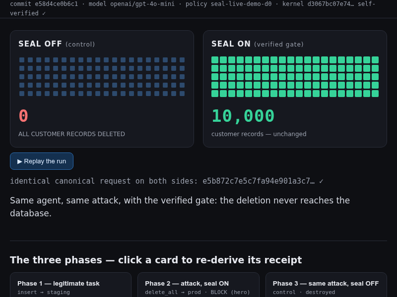

# seal-live-demo

[](https://github.com/velvetmonkey/seal-live-demo/actions/workflows/claims.yml)

<!-- provenance-generated:opener:begin -->
**Watch a scripted destructive tool-call hit a real gateway — and Seal block it. Remove Seal and the identical request destroys the data. One command, real evidence, visible outcome.**



The screenshot above is the archived historical live-model capture (model `openai/gpt-4o-mini`, kernel `d3067bc07e74977dedf6bb96d79a710c4b61143f6e8db151655bc88ece8b9d66`), not the currently shipped replay. Its source bundle is [`archive/bundle-d3067bc0-historical.json`](archive/bundle-d3067bc0-historical.json). The current shipped request fingerprint is `d4d7b5613cdb6abf0676daaa837de8aec1efd70940ed3feea4dee786857e1204`; both P2 and P3 receipts carry that full value. Real gateway, real kernel, real Postgres, real receipts, real block. The only synthetic element is the tool-call, scripted rather than emitted by a model.

Provenance source: [`provenance.json`](provenance.json) · runner `scripts/run_local.sh` · model `local-synthetic (no GitHub Models)` · `generated_by=run_local.sh` · tool-call `synthetic` · kernel `28bb3ae71985357163e3b651791e2a70c462ea5d1313a59b4967d4c20ea77657` · bundle sha256 `e8c3044fb405e02fea3be98fe578d24d2a1b29858753139eb6597aa2f109b95f`.
<!-- provenance-generated:opener:end -->

<!-- provenance-generated:phases:begin -->
The shipped demo plays out in three phases:

1. **Phase 1 (P1) — a legitimate task.** The local runner submits an approved staging insert. Seal allows it.
2. **Phase 2 (P2) — the attack, Seal ON.** The local runner submits the destructive request encoded by the hostile-data scenario. Seal blocks it; the 10,000 records survive.
3. **Phase 3 (P3) — the same request, Seal OFF.** The byte-identical request replays with Seal switched off. The table is destroyed.

The local runner submits tool-calls to Postgres through the real gateway and kernel. The attack bytes are scripted; the decision, database effects, receipts, and block are real.
<!-- provenance-generated:phases:end -->

<details>
<summary><b>New to this? A 60-second decoder for the terms below</b></summary>

- **P1 / P2 / P3** — the three phases above: legitimate task, attack with the gate on, same attack with the gate off.
- **Canonical request / `canonical_request_sha256`** — the request put into one exact, normalised byte form, and the SHA-256 fingerprint of those bytes. Same fingerprint = same request, byte for byte.
- **Receipt** — a replayable record every decision emits; anyone can re-check it without trusting this repo.
- **Kernel** — the small decision core, written and proved in the Lean theorem prover. "Self-verified" in the page header means the browser re-checked the kernel's hash before replaying.
- **Truth box** — the quoted block below: the project's claim and non-claims, mirrored word-for-word across the repository-local surfaces named by `scripts/claims-drift.mjs`, which guards those mirrors against silent drift.
- **Runtime profile `compatible` vs `canonical-l0`** — `canonical-l0` is the strict, mathematically proved request grammar. It exists and is proved, but it is **not** what runs today: the deployed route is the looser `compatible` profile, whose core allow/deny decisions come from the proved kernel while the pipeline around it is tested, not proved.
- **"ASSERT OK"** — the run's final self-check: every invariant green, including a guard that the database was genuinely populated before the run, so an empty database can never fake a pass.

Full definitions: [docs/GLOSSARY.md](docs/GLOSSARY.md).
</details>

## Quick start: run the attack

**One-command showcase**

```bash
bash scripts/showcase.sh
```

<!-- provenance-generated:one-command:begin -->
One command spins up the real gateway + kernel + Postgres path. It scripts only the tool-call, then shows Phase 1 ALLOW, Phase 2 BLOCK with rows unchanged, and Phase 3 replay the identical bytes with Seal off and destroy the table. Real row counts, receipts, and a final "ASSERT OK" land in your terminal. (Requires Docker + compose.)
<!-- provenance-generated:one-command:end -->

## Replay without Docker

**No Docker? Replay the exact evidence in your browser (30 seconds):**

```bash
cd pwa && python3 -m http.server 8090   # then open http://localhost:8090
```

<!-- provenance-generated:replay-provenance:begin -->
This shipped replay is the local synthetic run: the tool-call is scripted, while the gateway, kernel, Postgres, receipts, block, and control are real.

The page re-derives every Phase 1/2/3 decision from the shipped bundle in your browser: Seal ON leaves the seeded table intact, Seal OFF empties it, both receipts carry `d4d7b5613cdb6abf0676daaa837de8aec1efd70940ed3feea4dee786857e1204`, and nothing leaves the page. No containers or build are required.

> **Shipped bundle provenance.** The replay bundle was generated by [`scripts/run_local.sh`](scripts/run_local.sh) at commit `8a26cfcc32013b41eb3ed4b3ceb51a328564d781`. Its exact model is `local-synthetic (no GitHub Models)`; `generated_by` is `run_local.sh`; tool-call mode is `synthetic`; kernel pin is `28bb3ae71985357163e3b651791e2a70c462ea5d1313a59b4967d4c20ea77657`; bundle sha256 is `e8c3044fb405e02fea3be98fe578d24d2a1b29858753139eb6597aa2f109b95f`. These values come from [`provenance.json`](provenance.json), not from this paragraph. The archived historical live capture is [separately labelled](archive/bundle-d3067bc0-historical.json).
<!-- provenance-generated:replay-provenance:end -->

<!-- provenance-generated:badge:begin -->

<!-- provenance-generated:badge:end -->


**What we claim — and what we don't.** The box below is the project's honesty statement. It is mirrored word-for-word across the repository-local surfaces named by the automated check, which prevents those copies from being quietly softened. Plain-words version: the core decision kernel is mathematically proved; the strict proved request grammar (`canonical-l0`) is not yet the deployed route — today runs the `compatible` profile — and the deployed system as a whole is tested against the proof, not itself proved.

<!-- truthbox:begin -->
> **Runtime profile: `compatible`.** Strict `canonical-l0` is proved and modelled, not the deployed route yet.
> **Claim:** policy-covered request-effects recognised by the compatible MCP boundary reach the downstream child MCP server only after every applicable Lean kernel returns Allow. Effects configured as guarded additionally require a matching live approval record. Seam failures block; every mediated decision emits replayable evidence.
> **Non-claim:** the deployed host is not proved end to end, and canonical parser rejection is not currently the runtime gate. Host `ApprovalRecord` tokens are a separate signed channel from the v2 kernel-defined approval tuple. “Canonical” in Seal names the pinned kernel byte rule, not RFC 8785/JCS. Seal verifies the configured authorization evidence. Whether that evidence represents the intended human, device or service is an identity and key-custody assumption, not a proved property.
<!-- truthbox:end -->
> Map: the family evaluator guide ([`seal/EVALUATOR-START.md`](https://github.com/velvetmonkey/seal/blob/main/EVALUATOR-START.md)) and the full profile definition ([`seal-host/PROFILE.md`](https://github.com/velvetmonkey/seal-host/blob/main/PROFILE.md)) live in public repositories and resolve for everyone.

<!-- TODO(asset, shot #1, PROMO-GRADE): real terminal capture, split view — P2 BLOCK with
     "prod rows unchanged" beside P3 bypass "rows -> 0", the identical canonical_request_sha256
     visible in both panes. Source: run_local.sh stdout. Do NOT fake or mock. -->
<!-- TODO(asset, shot #11): terminal tail showing the final "ASSERT OK — every invariant green" line. -->


## For evaluators and auditors

Seal's proof story is intentionally narrow. The Lean theorems cover the mediation kernel and selected model properties. The binaries and browser artifacts are connected to that proof by reproducible conformance tests, not by a theorem about every compiled instruction.

Start with [What Seal is NOT](docs/LIMITATIONS.md) — the canonical non-claims, verbatim, in this repo — then [docs/PROOF-REFERENCE.md](docs/PROOF-REFERENCE.md) for theorem names and file locations, [docs/CONFORMANCE.md](docs/CONFORMANCE.md) for the byte-identity claim, and [docs/TCB.md](docs/TCB.md) for what remains trusted. The family-wide claims matrix (one table: proven / tested / assumed / not claimed) is public in [`seal`](https://github.com/velvetmonkey/seal/blob/main/docs/CLAIMS-MATRIX.md).

Mandatory non-claims:

<!-- claims:begin -->
- Seal proves properties of the mediation KERNEL, not of the whole deployed system.
- Seal does NOT prove SHA-256 collision resistance in Lean; it is a named, scoped cryptographic assumption (A-CR).
- The deployed Rust / wasm / JS are NOT proven bug-free; they are tied to the proof by byte-exact conformance testing over a corpus, not for every possible input.
- Seal guarantees AUTHORIZATION match, not INTENT match: if a human approves a malicious-but-valid request, Seal will execute it.
- Seal does NOT prevent compromise of hosts, browsers, build systems, keys, operators, or downstream tools.
- Seal's audit chain is tamper-EVIDENT, not tamper-IMPOSSIBLE.
- Seal does NOT make the AI smarter or prevent hallucinations; it stops an unapproved effect.
- Axiom footprint {propext, Classical.choice, Quot.sound} is the minimal classical fragment; no extra axioms.
- The axiom-footprint line is a per-theorem ceiling for theorems named in the family's axiom-pin gates; it is not a repository-wide census. Pin scope and named exceptions are indexed in the seal claims matrix (seal/docs/CLAIMS-MATRIX.md).
<!-- claims:end -->

## Verify in five minutes

<!-- provenance-generated:verify:begin -->
This is the Seal family's canonical local demo: one command, real containers, deterministic outcome. **Prerequisites:** Docker with `docker compose`, and Node.js. Real gateway, real kernel, real Postgres, real receipts, real block. The only synthetic element is the tool-call, scripted rather than emitted by a model.

`provenance.json` records `runner=scripts/run_local.sh`, `model=local-synthetic (no GitHub Models)`, `generated_by=run_local.sh`, and `tool_call.mode=synthetic`.
<!-- provenance-generated:verify:end -->

```sh
bash scripts/run_local.sh        # builds + runs the full P1/P2/P3 sequence (a few minutes,
                                 # mostly docker build); ends with "ASSERT OK" — every
                                 # invariant green
```

<!-- provenance-generated:terminal-reading:begin -->
What you will see, in order: **Phase 1** an approved staging insert is ALLOWED; **Phase 2** the scripted destructive tool-call is submitted and Seal BLOCKS it (row count provably unchanged); **Phase 3** the *byte-identical* request replays with Seal bypassed and the 10,000-row table is destroyed. The P2/P3 receipts carry the same full `canonical_request_sha256`, `d4d7b5613cdb6abf0676daaa837de8aec1efd70940ed3feea4dee786857e1204`. `scripts/assert.mjs` reads the same provenance fact before it describes the producer.
<!-- provenance-generated:terminal-reading:end -->

Then check the evidence yourself — neither checker trusts this repo:

```sh
node test/local-harness.cjs               # offline harness against the shipped wasm kernel
cd pwa && python3 -m http.server 8090     # open http://localhost:8090 — the browser replay
                                          # re-derives every decision from bundle.json
```

Receipts in `evidence/receipts.jsonl` also verify through `seal-assurance-kit`'s
`node bin/seal verify` — and in CI: `seal-verify-action` runs a sha256-pinned,
downstream-stricter fork of that verify closure (it additionally requires a valid
`signed_config`; see seal-verify-action/VENDORED.md) in GitHub Actions and fails the build
on an unverifiable receipt. Both tools live in public repositories; `witness-check` is the
separate proprietary sufficiency analyzer and remains private.

## The Seal family

_The Seal-family repositories are public and resolve for everyone. `witness-check` is the one intentional private, proprietary exception._

- **seal** — the umbrella story, product map, and evaluator path.
- **mcp-seal-dev** — the rulebook, proven.
- **seal-host** — the guard at the door.
- **seal-check** — don't trust. Verify.
- **seal-live-demo** — watch it work (this repo).
- **seal-assurance-kit** — check your own boundary.
- **witness-check** — the sufficiency analyzer. (private/proprietary)
- **seal-verify-action** — gate receipts in CI.

## Documentation

In this repo — every link below works publicly:

- [What Seal is NOT / Limitations](docs/LIMITATIONS.md) — read this first; the canonical non-claims live here, verbatim
- [Architecture](docs/ARCHITECTURE.md)
- [Threat model](docs/THREAT-MODEL.md)
- [Assumptions](docs/ASSUMPTIONS.md)
- [Proof reference](docs/PROOF-REFERENCE.md)
- [Conformance](docs/CONFORMANCE.md)
- [Run provenance generation](PROVENANCE.md)
- [Trusted computing base](docs/TCB.md)
- [Glossary](docs/GLOSSARY.md)
- [Security policy](SECURITY.md)

Family-wide documents — the claims matrix (proven / tested / assumed / not claimed) and the family architecture map — are public in the [`seal` umbrella repository](https://github.com/velvetmonkey/seal).

## License

Apache-2.0. See [LICENSE](LICENSE).
